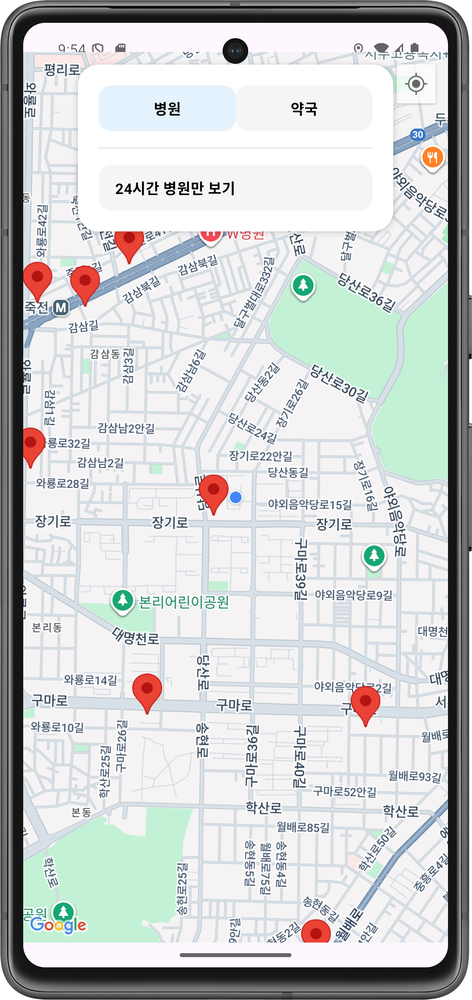
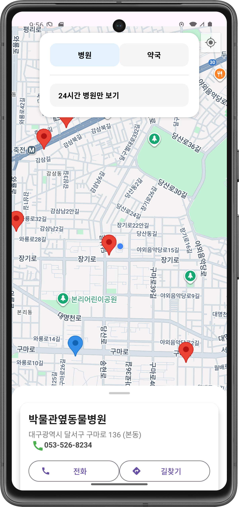
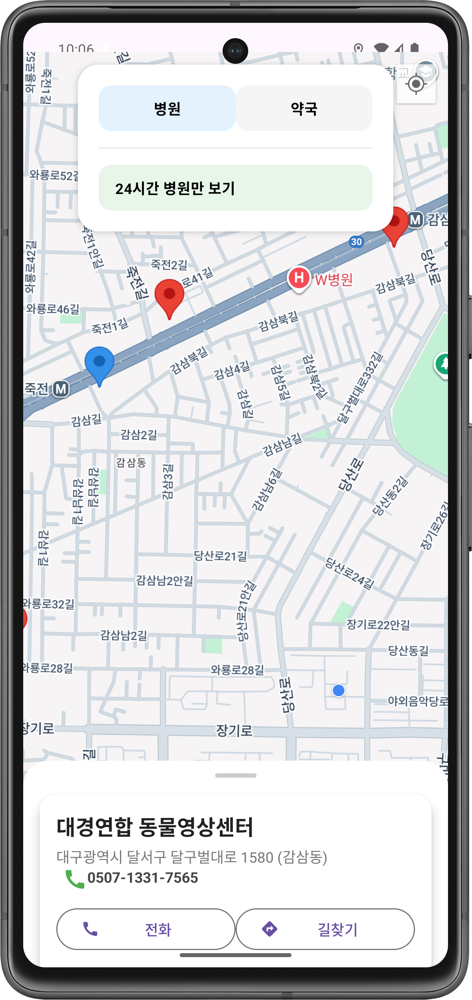
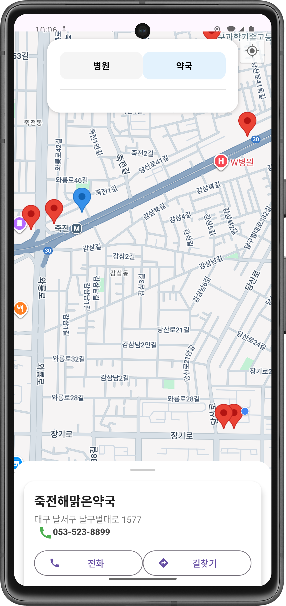
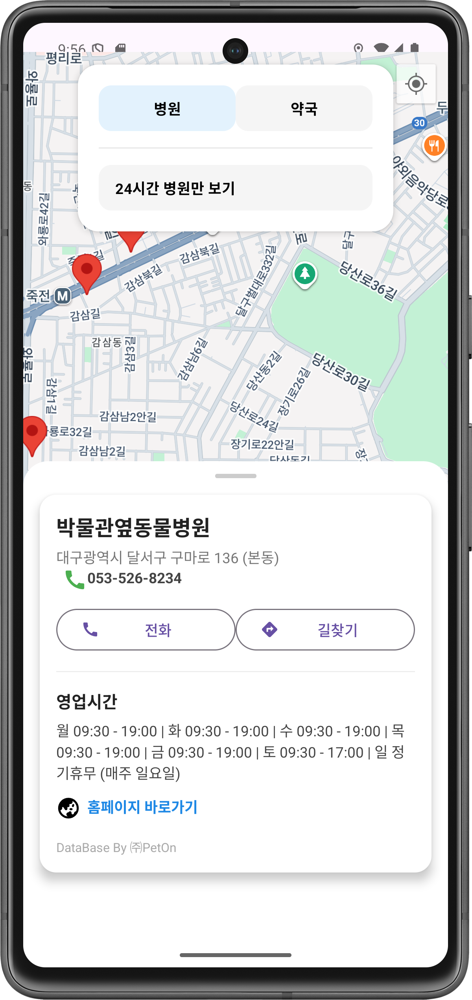
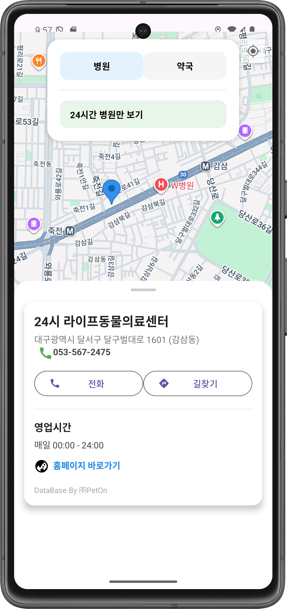
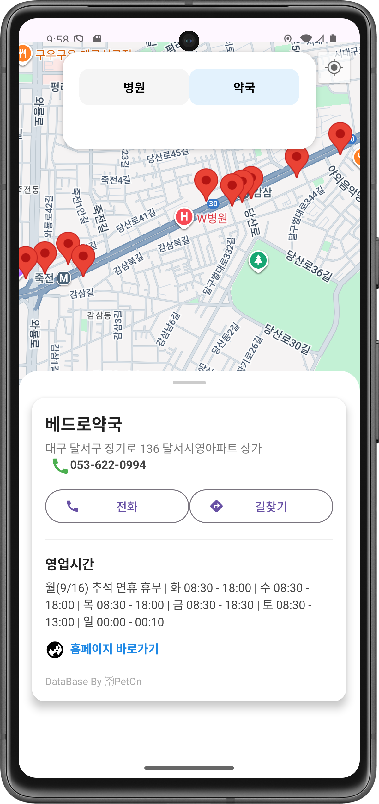
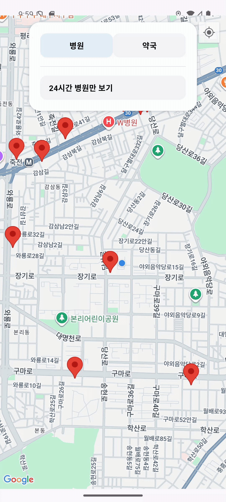
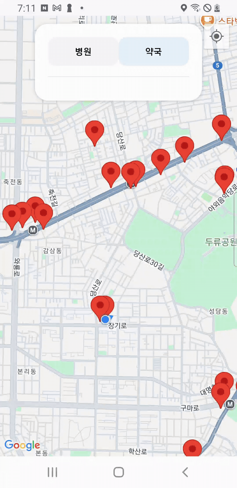
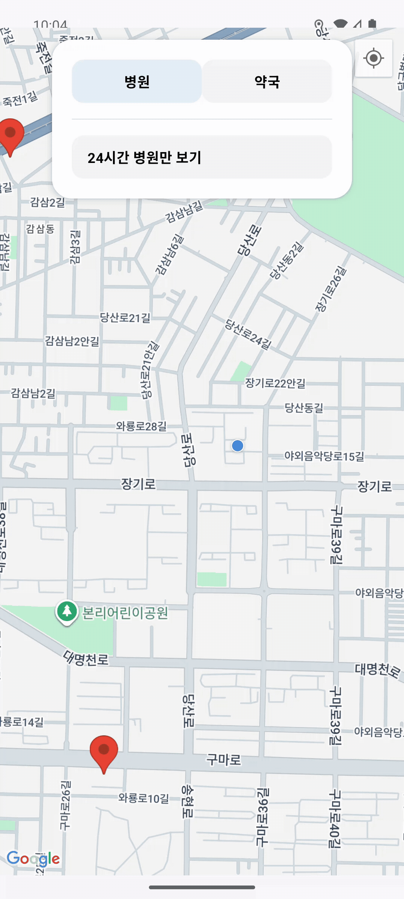

# 🐾 Pet Medical Map

반려동물을 키우는 보호자를 위해 동물병원 및 동물 의약품을 취급하는 약국 정보를 지도 기반으로 제공하는 안드로이드 앱입니다.

이 앱은 단순한 위치 조회를 넘어, 위급하거나 시간이 촉박한 상황에서도 보호자가 빠르게 판단하고 바로 행동할 수 있도록 돕는 것을 목표로 합니다. 사용자의 현재 위치를 기준으로 주변 병원·약국을 직관적으로 보여주고, 필요한 행동까지의 과정을 최소화했습니다.

> 지도에서 주변 병원/약국을 한눈에 확인하고, 전화·길찾기·홈페이지 연결까지 최소한의 터치로 빠르게 접근할 수 있습니다

---

## 🚩 프로젝트를 진행하게 된 계기
반려견과 함께 생활하던 중, 약 2~3년 전 자정이 넘은 시간에 예기치 못한 사고를 겪은 경험이 있습니다. 강아지가 소파에서 뛰어내리다 앞다리가 부러지는 사고가 발생했고, 즉시 병원으로 이동해야 하는 긴급한 상황이었습니다.  

하지만 늦은 시간이라는 제약으로 인해 24시간 진료가 가능한 동물병원을 급하게 찾아야 했고, 위급한 상황에서 검색을 통해 여러 정보를 동시에 확인하는 과정이 쉽지 않았습니다. 결국 여러 번의 검색 끝에 가까운 병원을 찾아 이동할 수 있었지만, 그 과정에서 많은 불편함을 느끼게 되었습니다.

이 경험을 계기로,
- 위급한 상황에서도
- 빠르게 주변 동물병원 및 24시간 진료 병원을 확인하고
- 추가로 동물 의약품을 취급하는 약국 위치까지 한눈에 볼 수 있는 지도 기반 앱이 있다면

반려동물을 키우는 보호자들에게 실질적인 도움이 될 수 있겠다는 생각이 들었고, 이를 직접 구현해보고자 본 프로젝트를 시작하게 되었습니다.

---

## ✨ 주요 기능

- 🗺️ **지도 기반 병원/약국 마커 표시**  
  - Google Maps를 활용해 사용자의 현재 위치를 기준으로 주변 동물병원과 동물 의약품 취급 약국을 지도 위에 표시하여, 거리와 위치를 직관적으로 파악할 수 있습니다.

- 📍 마커 클릭 시 **상세 정보 BottomSheet 표시**  
  - 병원명, 주소, 연락처, 영업시간 등 핵심 정보를 BottomSheet로 제공하여, 지도 화면을 벗어나지 않고도 필요한 정보를 즉시 확인할 수 있습니다.
  
- 📞 전화 앱 연동 (Intent)  
  - 긴급 상황에서 추가 탐색 없이 바로 병원에 연락할 수 있도록, 전화 앱과 즉시 연결되는 기능을 제공합니다.
  
- 🧭 네이버 지도 길찾기 연동 (외부 앱 Intent)  
  - 선택한 병원의 위치 정보를 네이버 지도 앱으로 전달해, 현재 위치에서 목적지까지 빠르게 길 안내를 받을 수 있습니다.
  
- 🌐 병원 홈페이지 바로 연결 (브라우저 Intent)  
  - 병원 공식 홈페이지가 있는 경우, 진료 안내나 추가 정보를 확인할 수 있도록 브라우저로 즉시 연결합니다.
  
- ⏰ 영업시간 정보 표시 (원본 데이터 기반)  
  - 병원별로 상이한 영업시간 정보를 원본 데이터 기준으로 제공하여, 정보 손실 없이 실제 운영 시간을 확인할 수 있도록 했습니다.
---

## 🛠 기술 스택

* **Language**: Kotlin
* **Architecture**: MVVM + Repository Pattern
* **UI**: XML, BottomSheet, ConstraintLayout
* **Map**: Google Maps SDK
* **Data**: Room Database
* **Parsing**: Gson
* **Async**: Coroutine / Background Thread

---

## 🧱 프로젝트 구조

```
com.project.petmedicalmap
├─ ui
│  ├─ main
│  └─ detail
├─ viewmodel
├─ repository
├─ roomDB
│  ├─ entity
│  ├─ dao
│  └─ database
├─ model (DTO)
└─ util
```

---

## 📌 데이터 출처

* 병원/약국 정보: **㈜PetOn**에서 수집·정리하여 무료로 배포한 데이터 사용
* 해당 데이터가 없었다면 본 프로젝트의 기획 및 구현 자체가 어려웠을 만큼, 프로젝트의 출발점이 된 핵심 데이터입니다.
* **원본 데이터는 GitHub에 포함하지 않았으며**, `assets/` 디렉터리는 `.gitignore` 처리하였습니다.

---

## 🧠 개발 과정에서의 고민과 해결

* **Intent 활용 범위 확장**  
  기존에는 Intent를 액티비티 간 이동이나 데이터 전달 용도로만 사용했지만, 이번 프로젝트에서는 전화 앱 실행, 네이버 지도 길찾기, 병원 홈페이지 웹 연결 등 **외부 앱 및 시스템 기능과 연동하는 방식으로 활용 범위를 확장**했습니다. 이를 통해 Intent가 앱 내부뿐 아니라 안드로이드 생태계 전반을 연결하는 핵심 수단임을 이해하게 되었습니다.

* **외부 데이터 처리 및 JSON 파싱 과정**  
  병원/약국 데이터는 엑셀 파일 형태로 제공되어 그대로 사용할 수 없었기 때문에, 이를 JSON 형식으로 변환한 뒤 assets에 포함하는 방식으로 데이터를 준비했습니다. 이후 JSON 파일을 문자열로 읽어와 DTO로 파싱하고, 앱 내부에서 사용하기 적합한 형태로 가공한 뒤 Entity로 변환하여 Room DB에 저장하는 구조를 설계했습니다.
데이터 접근은 Repository를 단일 진입점으로 두고, ViewModel에서는 Repository를 통해 데이터만 요청하도록 구성하여 UI와 데이터 계층 간의 의존성을 분리했습니다. 이 과정에서 DTO, Entity, DAO의 역할을 명확히 구분하며 데이터가 앱 내부에서 어떻게 흐르고 관리되는지에 대한 이해를 높일 수 있었습니다.

* **영업시간 데이터 구조의 한계 판단**  
  특히 영업시간 데이터는 병원마다 형식이 크게 달라 요일, 시간대, 휴게시간 정보가 하나의 문자열에 혼재되어 있었습니다. 모든 케이스를 고려해 파싱 규칙을 만드는 데에는 과도한 복잡성이 따른다고 판단했고, **데이터 왜곡을 피하기 위해 원본 형식을 그대로 노출하는 방향으로 결정**했습니다.

---

## 🧩 프로젝트를 진행하며 배우고 느낀 점

이번 프로젝트의 기능 구현 난이도 자체는 아주 높지는 않았지만, **저에게는 처음 경험하는 요소들이 매우 많은 프로젝트**였습니다.

그동안 `Intent`는 주로 **액티비티 간 이동이나 데이터 전달 용도**로만 사용해왔는데, 이번 프로젝트를 통해

* 전화 앱 실행
* 네이버 지도와 같은 **외부 지도 앱으로 위치 전달**
* 병원 홈페이지를 **브라우저로 바로 연결**

등 다양한 방식으로 Intent를 활용하며, *Intent가 앱 외부와의 연결까지 담당하는 매우 강력하고 편리한 도구* 라는 것을 체감할 수 있었습니다.

또한 프로젝트를 기획할 당시에는

> “이걸 내가 과연 할 수 있을까?”
> 라는 걱정이 들 정도로 도전적인 요소가 많았습니다.

* Google Maps API 사용
* MVVM 패턴을 **연습용이 아닌 실제 개인 프로젝트에 적용**
* BottomSheet UI 구현
* 구조가 복잡한 JSON 데이터를 파싱하여 Room DB에 저장 및 활용

이 모든 요소가 처음이었기 때문에 시행착오도 많았지만, 문제를 하나씩 해결해 나가며 **새로운 기술을 실제 프로젝트에 적용하는 경험 자체가 큰 자산**이 되었습니다. 특히 지도 기반 서비스와 데이터 중심 구조를 직접 설계·구현하면서, 단순 기능 구현을 넘어 앱의 전체 흐름을 이해하는 시야를 넓힐 수 있었습니다.

---

## ⚠️ 아쉬운 점

* 병원별 **영업시간 데이터 형식이 일정하지 않아 전처리에 한계**가 있었습니다.
* 요일별, 시간대별, 휴게시간 여부 등이 문자열 형태로 제각각 제공되어 이를 하나의 통일된 구조로 파싱해 BottomSheet UI에 깔끔하게 표현하는 것이 현실적으로 어렵다고 판단했습니다.
* 결국 **데이터의 정확성을 우선시하여 원본 데이터 형식을 그대로 노출**하는 방향으로 마무리하였습니다.
* 향후 데이터 표준화가 가능하거나, 파싱 규칙을 더 정교하게 설계할 수 있다면 개선 여지가 있는 부분이라고 생각합니다.

---

## 📷 실행 화면 (Screenshots & GIFs)

### 메인 화면


- 앱 실행 시 기본적으로 **병원 마커가 지도에 표시**됩니다.
- 상단 필터를 통해 **병원 / 24시간 병원 / 약국**을 선택할 수 있으며,  
  선택된 조건에 따라 **지도 위 마커가 즉시 갱신되어 재배치**됩니다.
- 사용자는 원하는 의료 시설 유형을 빠르게 전환하며 주변 정보를 확인할 수 있습니다.

<br>

---

### 마커 클릭 시 기본 정보 제공
<table>
  <tr>
    <th>병원</th>
    <th>24시간 병원</th>
    <th>약국</th>
  </tr>
  <tr>
    <td></td>
    <td></td>
    <td></td>
  </tr>
</table>

- 지도에서 **마커를 클릭하면 하단에 바텀 시트가 부분적으로 노출**되며,  
  병원(약국)의 **이름, 주소, 전화번호** 등 핵심 정보를 즉시 확인할 수 있습니다.
- 바텀 시트를 완전히 열지 않아도 **전화 및 길찾기 버튼을 바로 사용할 수 있도록 구성**하여,  
  긴급 상황에서도 빠르게 행동할 수 있도록 UX를 고려했습니다.

<br><br>

---

### 바텀 시트 상세 정보
<table>
  <tr>
    <th>병원</th>
    <th>24시간 병원</th>
    <th>약국</th>
  </tr>
  <tr>
    <td></td>
    <td></td>
    <td></td>
  </tr>
</table>

- 바텀 시트를 확장하면 **영업시간 정보**와 함께  
  **홈페이지 바로가기 버튼**이 표시됩니다.
- 기본 정보와 상세 정보를 단계적으로 분리하여,  
  사용자가 필요한 정보만 선택적으로 확인할 수 있도록 설계했습니다.

---

### 전화 기능


- 전화 버튼을 클릭하면 **전화 앱이 즉시 실행되며**,  
  해당 병원 또는 약국의 **전화번호가 자동으로 입력**됩니다.
- 번호를 복사하거나 입력할 필요 없이 **즉시 통화가 가능하도록 구현**했습니다.

---

### 길찾기 기능


- 길찾기 버튼 클릭 시,  
  병원(약국)의 **위도·경도 및 이름 정보가 외부 앱인 네이버 지도에 전달**됩니다.
- 네이버 지도에서 **현재 위치 기준 길찾기 화면이 바로 실행**되어  
  빠르게 이동 경로를 확인할 수 있습니다.

---

### 홈페이지 바로 이동


- 홈페이지 정보가 존재하는 경우,  
  바텀 시트에 **‘홈페이지 바로가기’ 텍스트가 동적으로 표시**됩니다.
- 클릭 시 해당 병원(약국)의 **공식 홈페이지로 즉시 이동**하여  
  추가적인 진료 정보나 공지사항을 쉽게 확인할 수 있습니다.

---

본 프로젝트는 학습 및 포트폴리오 용도로 제작되었습니다.
